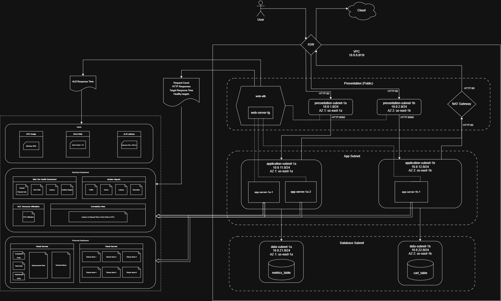
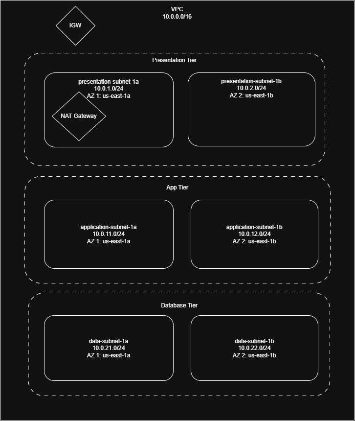
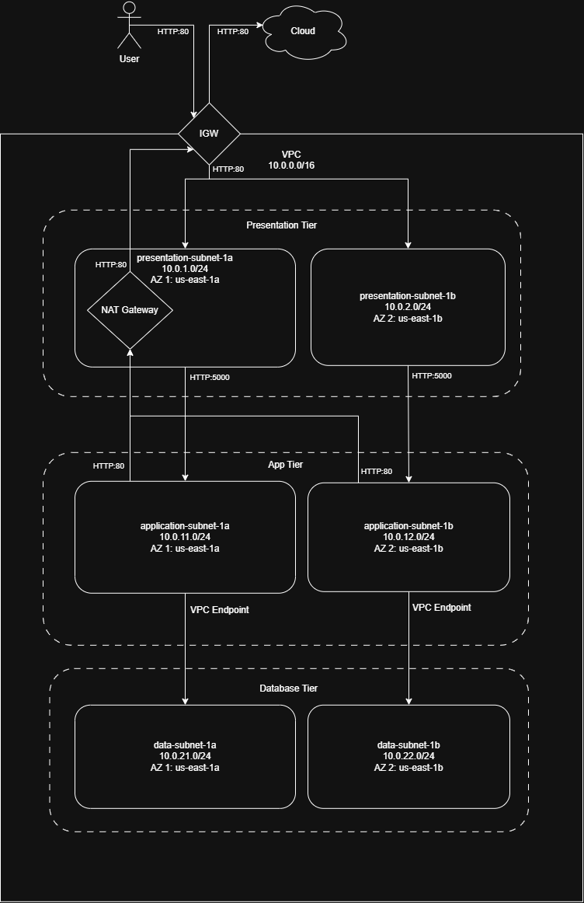

# Architecture 

## Detailed component descriptions

The general overview of the architecture can be seen in the following picture: 

The main components can be described as follows: 
- **VPC**: The container of the network infrastructure. The purpose is to hold the subnets and network components of the system. 
- **ALB**: Responsible for forwarding the requests to the servers attached to the target groups that belongs to the ALB. As a complementary purpose, it monitors the instances attached and sends metrics to CloudWatch. 
- **NAT Gateway**: Allows outbound communication to the internet for private app subnets. It allows the instances to download packages needed for the execution of the application. 
- **Internet Gateway**: Allows the internet access to the VPC. This is the gateway between internet and all components of the VPC. 
- **Web Servers**: Instances that hold the application to execute and handle the requests coming from the ALB. 
- **Database**: Stores data managed by the application in a safe storage. 
- **CloudWatch Alerts**: Trigger alarms in case of an inconsistency on the network. 
- **CloudWatch Dashboards**: Allows the real-time monitoring of the network and business behavior. 

## Network design and security groups

The following picture shows the **Network Diagram** of the system: 

**Tier 1 - Presentation (Public):**
- presentation-subnet-1a
	- IPv4 CIDR: 10.0.1.0/24
	
- presentation-subnet-1b
	- IPv4: 10.0.2.0/24

**Tier 2 - Application (Private):**
- app-subnet-1a 
	- IPv4: 10.0.11.0/24
	
- app-subnet-1b    
	- IPv4: 10.0.12.0/24

**Tier 3 - Data (Private):**
- data-subnet-1a 
	- IPv4: 10.0.21.0/24
	
- data-subnet-1b
	- IPv4: 10.0.22.0/24

The following picture shows the **Security Groups** created for the system: 

The purpose of each security group are: 
- **ALB Security Group:** Allow access from the internet to the network  
- **App Security Group:** Allow only requests from the ALB subnets and allow access to database tier.
- **Database Security Group:** Allow only requests from the app tier. 
- **SSM Security Group:** Enable communication with EC2 instances that reside in the app tier (Debugging purposes but in a more secure way)

## Data flow diagrams and explanations

The following picture shows the data flow on the network: 

- User sends a request via HTTP using port 80. 
- Request goes through the IGW and is received by the ALB, which resides in a presentation subnet. 
- Request is then forwarded to an application subnet to be received by a server, which will do the corresponding operations. 
- In case the operations require the storage of data, the application will send a request to a database to store/query data.
- Data would be delivered/store by the database back to the application. 
- The application will send a response to the ALB with the result of the request. 

## High availability strategy

- Each tier has at least 2 subnets in different Availability Zones
- An Auto-Scaling Group was configured to have at least 3 instances running to handle the requests. 

## Scalability considerations

- Add a Multi-AZ NAT Gateway to increase availability. 
- Add secure protocol HTTPS to handle sensitive data (since the application manages bank details, this is high priority)
- Database replicates in different AZ

## Technology choices and rationale

- Frontend: HTML - sufficient for a simple UI that shows the necessary widgets to collect the required Data
- Backend: Python Flask app and Gunicorn - flexibility and availability of features that can be incorporated to the application
- Database: DynamoDB - sufficient for storing the amount of data generated by the application. 
