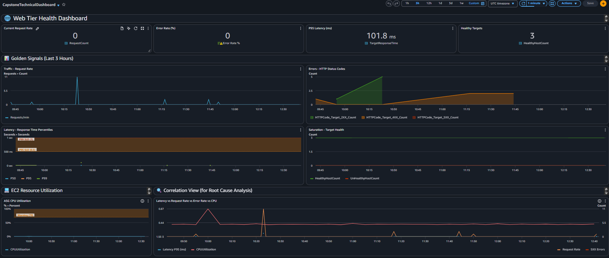
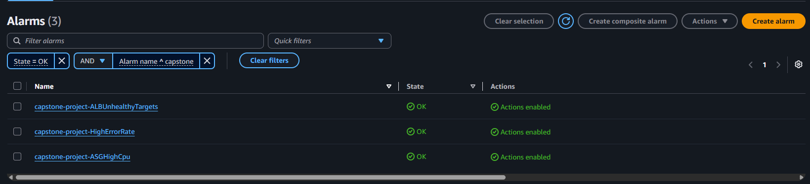

# Runbook

## How to deploy infrastructure

- In case no module generate a required resource:
  - Create a new module under the folder *terraform/modules*, add the files *variables.tf*, *outputs.tf* and *module-name.tf*. 
  - Define the inputs of the module in *variables.tf*.
  - Define the outputs of the module in *outputs.tf*
  - Define the desired resource to be build by terraform in *module-name.tf*.
  - In *terraform/*, call the module created in the *main.tf* file as follows:
    ```
    module "module-instance-name" {
      source = "./modules/your-new-module"

      # Define variables here
    }
    ```
  - If needed, use outputs of another module with the format *module.other-module-name.output-name*

- In case of creating a new resource using an existing module, just call the module again in the *main.tf* file as follows:
  ```
  module "new-module-instance" {
      source = "./modules/existing-module"

      # Define variables here
  }
  ```

- Infrastructure plan will be done in every Pull Request to main branch. 
- Infrastructure application will be done in every merge to main branch. 

## How to update application

- Application files are located in *app/src* and the application is composed by three main components: 
  - **app.py**: Contains the logic of the application (endpoint callbacks, monitoring data, store data, metrics generation and logging creation)
  - **requirements.txt**: Contains the dependencies of the application. 
  - **templates/index.html**: Contains the definition of the UI. 
- Update *app.py* when a change in the logic is needed. 
- Update *index.html* when a change in the UI is needed. 
- Update *requirements.txt* when a change in the dependencies is needed. 
- Commit changes and push them to the main file for terraform application. 
- Terraform will upload the application to an S3 Bucket to be accessible by the Auto-Scaling Group. 
- To reflect the changes in the instances, terminate the current running instances. ASG will automatically generate new instances with the new application. 

## How to monitor system health

1. The application handles a health enpoint, to monitor the status use the following url: 
```
http://capstone-project-alb-931963269.us-east-1.elb.amazonaws.com/health
```

2. System Health is shown in the widgets *HealthyTargets* and *Saturation - Target Healt* in the *CapstoneTechnicalDashboard*. These widgets give a status of how many targets of the ALB are healthy. 



3. In the system alert, an alert triggers an alarm in case the ALB has an unhealthy target. 



## Common troubleshooting scenarios

1. Application is marked as unhealthy or crashed. 
  - Troubleshoot by accessing the instance using the command: 
    ```
    aws ssm start-session --target
    ```
    
## Incident response procedures

### High CPU Utilization

- [ ] Identify the affected EC2 instance/service.
- [ ] Check CPU utilization in CloudWatch and determine how long it has been elevated.
- [ ] Check whether traffic/request volume has increased.
- [ ] Identify processes consuming excessive CPU.
- [ ] If caused by expected traffic, scale the service/instance if necessary.
- [ ] If caused by a runaway process, restart the affected service if safe.
- [ ] Monitor CPU until it returns to normal.
- [ ] Escalate if CPU remains high or the application is unavailable.

### High Memory Utilization

- [ ] Identify the affected EC2 instance/container.
- [ ] Check memory utilization and available memory.
- [ ] Identify processes consuming the most memory.
- [ ] Check for recent deployments or configuration changes.
- [ ] If memory usage is caused by a temporary issue, restart the affected service if appropriate.
- [ ] If the workload legitimately requires more memory, scale the instance/container.
- [ ] Monitor memory usage after remediation.
- [ ] Escalate if memory continues to increase or the application becomes unstable.


### High Application Error Rate

- [ ] Check the error-rate CloudWatch metric and determine when the problem started.
- [ ] Check application logs for the specific errors.
- [ ] Check whether there was a recent deployment or configuration change.
- [ ] Check dependent services such as databases, APIs, queues, and other AWS services.
- [ ] Determine whether the problem affects all users or a specific endpoint.
- [ ] If a recent deployment caused the issue, consider rolling it back.
- [ ] If the service is overloaded, scale it if appropriate.
- [ ] Monitor the error rate after taking corrective action.
- [ ] Escalate immediately if the application remains unavailable or customer impact is significant.

### High Response Time

- [ ] Identify the affected application/service or endpoint.
- [ ] Check when the latency increase started.
- [ ] Check request volume and traffic patterns.
- [ ] Compare latency with CPU, memory, disk, and network metrics.
- [ ] Check application logs and traces for slow operations.
- [ ] Check database performance and slow queries.
- [ ] Check external API/dependency latency.
- [ ] Check for recent deployments or configuration changes.
- [ ] Scale the affected service if the problem is capacity-related.
- [ ] Roll back a recent change if it is identified as the likely cause.
- [ ] Monitor response time until it returns to the normal range.
- [ ] Escalate if latency remains high or customers are experiencing significant impact.