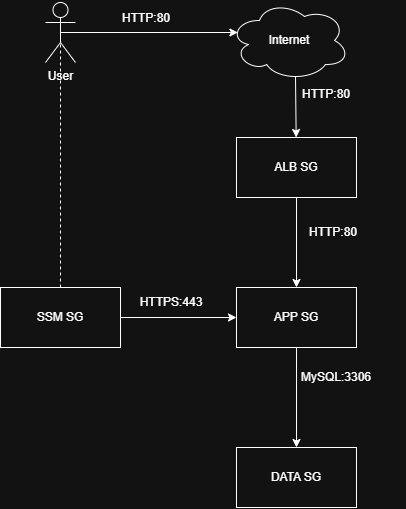

# Security 

## Security controls implemented

- Creation of IAM Roles to allow access to certain resources to interact with other resources inside the network. 
- Creation of Security Groups to implement a least-priviledge approach for the communication between tiers and user. 

## Compliance frameworks addressed

The compliance frameworks used to perform the security scan are: 

- **TfSec**:

```yml
name: tfsec
      runs-on: ubuntu-latest
      steps:
        - uses: actions/checkout@v4

        - name: tfsec scan
          uses: aquasecurity/tfsec-action@v1.0.3
          with:
            working_directory: ./terraform
            soft_fail: false
```

- **Trivy**:

```yml
name: trivy
      runs-on: ubuntu-latest
      steps:
        - uses: actions/checkout@v4

        - name: Trivy config scan (IaC misconfig)
          uses: aquasecurity/trivy-action@v0.35.0
          with:
            scan-type: config
            scan-ref: ./terraform
            exit-code: 0
            severity: CRITICAL,HIGH
```

## IAM roles and policies

### Roles

- **capstone-project-app-role**: Gives the application EC2 instances permission to access AWS services such as S3, CloudWatch, DynamoDB, and Systems Manager

### Custom Policies

- **capstone-project-app_s3**: Allows the EC2 application servers to download/read objects from the application's S3 bucket.
- **capstone-project-app-cloudwatch-logs**: Allows the EC2 instances/CloudWatch Agent to create CloudWatch log groups and streams and send application/system logs to CloudWatch Logs.
- **capstone-project-app-cloudwatch-metrics**: Allows the application/CloudWatch Agent to publish custom metrics to Amazon CloudWatch.
- **capstone-project-dynamodb-access**: Allows the Flask application running on EC2 to read and modify data in DynamoDB carts and metrics tables.

### AWS Managed Policies

- **AmazonSSMManagedInstanceCore**: Allows AWS Systems Manager (SSM) to manage your EC2 instances. This is what enables to connect/manage the instances through SSM rather than needing SSH access.

### Instance Profile

- **aws_instance_profile.app**

## Network security strategy

### capstone-project-alb-sg

| Direction | Port | Source / Destination | Purpose |
|-----------|------|----------------------|---------|
| Inbound | 80 | 0.0.0.0/0 | Public HTTP (internet-facing) |
| Outbound | All | 0.0.0.0/0 | Package downloads |

### capstone-project-app-sg

| Direction | Port | Source / Destination | Purpose |
|-----------|------|----------------------|---------|
| Inbound | 80 | capstone-project-alb-sg | App traffic from ALB |
| Outbound | All | 0.0.0.0/0 | Package downloads |

### capstone-project-data-sg

| Direction | Port | Source / Destination | Purpose |
|-----------|------|----------------------|---------|
| Inbound | 3306 | capstone-project-app-sg | MySQL from app tier only |
| Outbound | All | 0.0.0.0/0 | Package downloads |

### capstone-project-ssm-endpoint-sg
| Direction | Port | Source / Destination | Purpose |
|-----------|------|----------------------|---------|
| Inbound | HTTPS | capstone-project-app-sg | Communication to app tier |
| Outbound | All | 0.0.0.0/0 | Package downloads |




- Database can only receive requests from application tier. 
- Application tier does not listen directly to the internet (remains private) 
- Only Application Load Balancer can send requests which come from the internet.
- AWS Session Manager is only allowed to access the instances in app tier.

## Secrets management approach

Usage of GitHub secrets to store AWS_ACCESS_KEY_ID and AWS_SECRET_ACCESS_KEY to allow Git to perform actions on AWS using terraform code. 

## Security testing results

### Tfsec Compliance Scan Report
 
**Summary**
- Total Checks: 66
- Passed: 30 (45%)
- Failed: 36 (55%)
 
**Top 5 Failed Checks**
 
1. **Listener for application load balancer does not use HTTPS** - CRITICAL
2. **Security group rule allows egress to multiple public internet addresses** - CRITICAL
3. **Application load balancer is not set to drop invalid headers** - HIGH
4. **Bucket does not have encryption enabled** - HIGH
5. **IAM policy document uses sensitive action 'logs:CreateLogGroup' on wildcarded resource 'arn:aws:logs:*:*:** - HIGH

### Trivy Compliance Scan Report

**Summary**


|                   Target                   |   Type    | Misconfigurations |
|--------------------------------------------|-----------|-------------------|
| .                                          | terraform |         0         |
| modules/alb/alb.tf                         | terraform |         3         |
| modules/compute/compute.tf                 | terraform |         6         |
| modules/database/database.tf               | terraform |         0         |
| modules/monitoring/instrumentation.tf      | terraform |         0         |
| modules/monitoring/monitoring.tf           | terraform |         1         |
| modules/networking/networking.tf           | terraform |         2         |
| modules/security-groups/security-groups.tf | terraform |         4         |

Total: 16 Misconfigurations

**Top 5 Failed Checks**
 
1. **Listener for application load balancer does not use HTTPS** - CRITICAL
2. **Application load balancer is not set to drop invalid headers** - HIGH
3. **Launch template does not require IMDS access to require a token** - HIGH
4. **Bucket does not encrypt data with a customer managed key** - HIGH
5. **Security group rule allows unrestricted egress to any IP address** - CRITICAL

## Known risks and mitigations


| Risk	                                         | Observation	                      | Severity	   | Mitigation | 
|------------------------------------------------|-----------------------------------|--------------|------------|
| **Policies not in least-privilege compliance** | CloudWatch Logs policy (arn:aws:logs:*:*:*) and the DynamoDB policy, which could potentially be narrowed further to exactly the resources/actions the application needs	                      | Medium	   | Update Policies to allow only the exactly resources needed |
| **HTTP rather than HTTPS** | Load balancer configuration includes an HTTP listener | High	   | Add an ACM certificate and HTTPS listener on port 443. Redirect HTTP → HTTPS |
| **S3 permissions could be tightened** | Application role has s3:GetObject against the bucket's objects | Medium | Restrict it to the exact object prefix the application needs and explicitly deny unintended access if appropriate |
| **EC2 metadata service** | No IMDSv2 enforcement in the launch template  | Medium | Require IMDSv2 with http_tokens = "required" |
| **No explicit WAF protection** | The public ALB is an obvious application attack surface | Medium | Add AWS WAF to the ALB, particularly if this is intended to resemble production infrastructure. |


