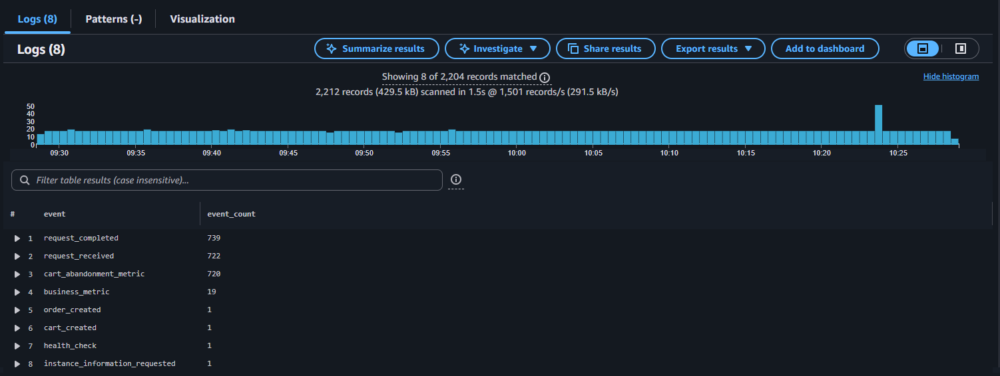
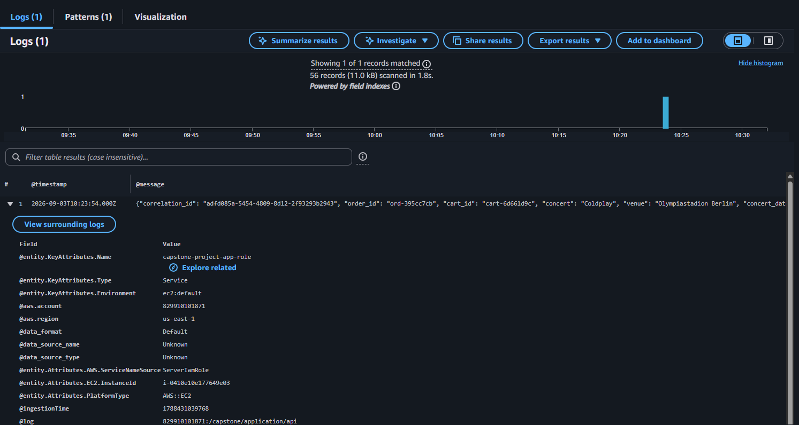
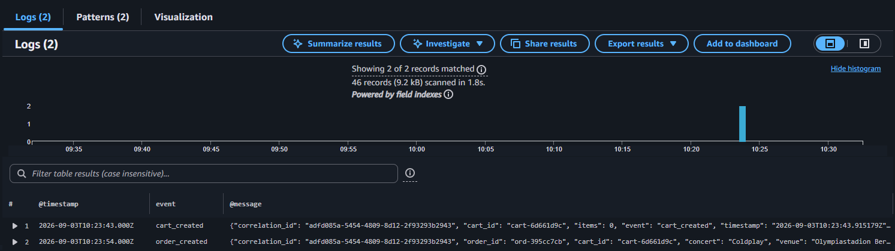

# Queries

## Events per Type

This query counts every event type logged and prints the number of each event registered so far. The query code looks as follows: 

```
fields event
| stats count() as event_count by event
| sort event_count desc
```

An example of the output can be seen in the following picture: 




## Orders Created

This query looks for every log line related to a created order. The query code is the following: 

```
fields @timestamp, @message
| filter event = "order_created"
| sort @timestamp desc
| limit 20
```

An example of the output can be seen in the following picture: 




## Request per Correlation ID

This query looks for an specific log line that includes an specific correlation id. 

```
fields @timestamp, event, @message
| filter correlation_id = "adfd085a-5454-4809-8d12-2f93293b2943"
| sort @timestamp asc
```

An example of the output can be seen in the following picture: 

